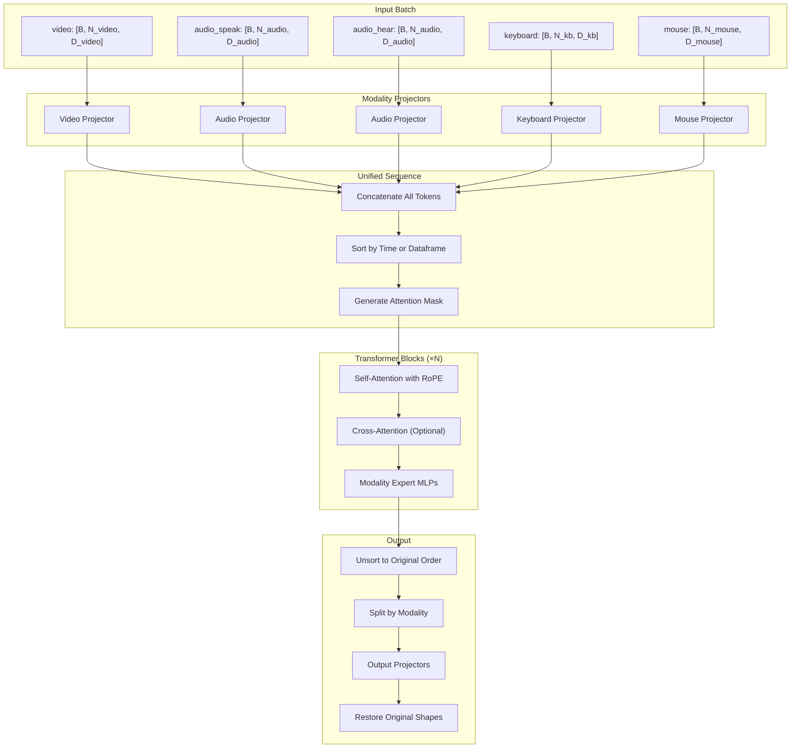
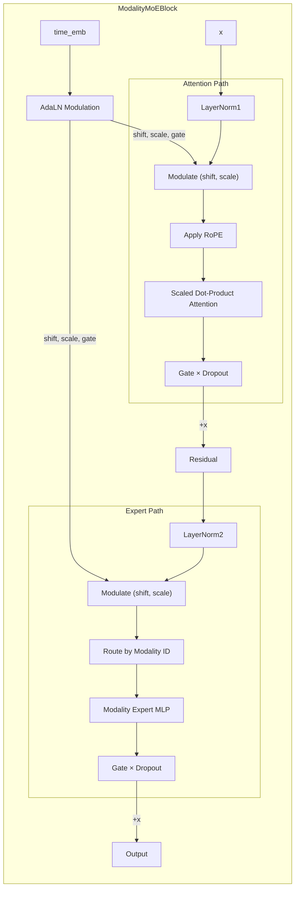
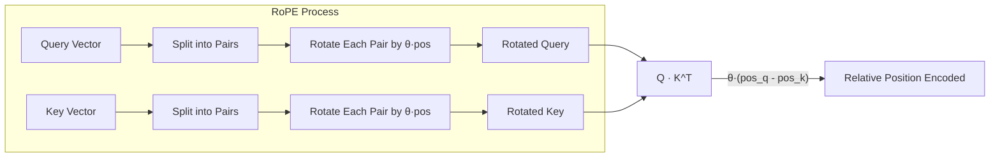

# MoE Decoder - Technical Documentation

This document provides a comprehensive walkthrough of the `MoEDecoder` implementation, explaining how multi-modal data flows through the architecture, how attention mechanisms work, and how rotary position embeddings (RoPE) are applied.

---

## Table of Contents

1. [Architecture Overview](#architecture-overview)
2. [Input Format and Shapes](#input-format-and-shapes)
3. [Data Flow Pipeline](#data-flow-pipeline)
4. [Modality Processing](#modality-processing)
5. [Sequence Construction](#sequence-construction)
6. [Attention Masks](#attention-masks)
7. [Attention Mechanism](#attention-mechanism)
8. [RoPE (Rotary Position Embeddings)](#rope-rotary-position-embeddings)
9. [Mixture of Experts (MoE)](#mixture-of-experts-moe)
10. [Output Restoration](#output-restoration)
11. [Complete Shape Walkthrough](#complete-shape-walkthrough)

---

## Architecture Overview

The MoEDecoder is a **multi-modal transformer** designed for processing synchronized data from multiple input sources (video, audio, keyboard, mouse). It uses:

1. **Modality-specific projectors**: Convert each modality to a shared embedding space
2. **Unified temporal sequence**: All modalities are combined and sorted by time
3. **Shared attention with RoPE**: All tokens attend to each other with temporal/spatial position encoding
4. **Modality-specific expert MLPs**: After attention, tokens are routed to experts based on their modality



### Detailed Component Diagram



---

## Input Format and Shapes

### Expected Input Dictionary (`batch`)

The model expects a dictionary where each key is a modality name and each value is a tensor:

| Modality | Expected Shape | Description |
|----------|---------------|-------------|
| `video` | `[B, N, D]` | Video patches: Batch, Sequence length, Feature dimension |
| `audio_speak` | `[B, N, D]` | Speaker audio: Batch, Sequence length, Feature dimension |
| `audio_hear` | `[B, N, D]` | Listener audio: Batch, Sequence length, Feature dimension |
| `keyboard` | `[B, N, D]` | Keyboard events: Batch, Sequence length, Feature dimension |
| `mouse` | `[B, N, D]` | Mouse events: Batch, Sequence length, Feature dimension |

### Concrete Example Shapes

```python
batch = {
    'video':       torch.randn(4, 320, 256),               # [4, 320, 256] - pre-patchified
    'audio_speak': torch.randn(4, 150, 128),               # [4, 150, 128]  
    'audio_hear':  torch.randn(4, 150, 128),               # [4, 150, 128]
    'keyboard':    torch.randn(4, 100, 32),                # [4, 100, 32]
    'mouse':       torch.randn(4, 200, 16),                # [4, 200, 16]
}
timestep = torch.rand(4)                                   # [4] - diffusion timestep in [0, 1]
```

> [!NOTE]
> All modalities now use the uniform `[B, N, D]` format. Video patchify/unpatchify 
> should be handled externally (e.g., in data preprocessing or a separate module).

### Sampling Rates

Each modality has a defined sampling rate that determines its temporal resolution:

```python
SAMPLING_RATES = {
    'audio_speak': 75.0,   # Hz - 75 audio tokens per second
    'audio_hear': 75.0,    # Hz
    'keyboard': 50.0,      # Hz - 50 keyboard events per second
    'mouse': 100.0,        # Hz - 100 mouse events per second
    'video': 10.0,         # FPS - 10 frames per second
}
```

---

## Data Flow Pipeline

### Step 1: Timestep Embedding

```python
# Input:  timestep [B]
# Output: time_emb [B, embed_dim]

time_emb = self.t_embedder(timestep)
```

The `TimestepEmbedder` converts scalar diffusion timesteps (in [0, 1]) to high-dimensional embeddings:

1. **Sinusoidal encoding**: Creates frequency-based embeddings (like transformer positional encoding)
2. **2-layer MLP**: Projects to `embed_dim`

```
timestep: [4]
    ↓ sinusoidal encoding
freq_emb: [4, 256]
    ↓ MLP
time_emb: [4, 512]  (assuming embed_dim=512)
```

---

## Modality Processing

### All Modalities (Uniform Processing)

All modalities (including video) are now processed uniformly:

```python
# For each modality:
# 1. Flatten to [B, N, D]
x_flat = x.reshape(batch_size, -1, target_dim)  
#    input:  [4, 150, 128] (audio_speak) or [4, 320, 256] (video)
#    output: [4, 150, 128] or [4, 320, 256] (unchanged for already flat inputs)

# 2. Compute timestamps based on sampling rate
rate = self.SAMPLING_RATES.get(mod_name, 1.0)  # 75.0 for audio, 10.0 for video
indices = torch.arange(N, device=device).float()  # [0, 1, 2, ..., N-1]
t_pos = indices / rate  # timestamps in seconds

# 3. Spatial positions (zero for all modalities now)
x_pos = torch.zeros(N, device=device)
y_pos = torch.zeros(N, device=device)

# 4. Project to shared embedding dimension
x_proj = self.projectors[mod_name](x_flat)
#    output: [B, N, embed_dim]

# 5. Add modality type embedding
x_proj = x_proj + self.modality_embeddings[mod_name]
```

> [!IMPORTANT]
> For video, patchify should be done **externally** before passing to the model.
> This ensures consistency with other modalities and simplifies the model architecture.

---

## Sequence Construction

After processing each modality, tokens are concatenated and arranged:

### Concatenation

```python
all_x = torch.cat([p['x'] for p in processed_tokens], dim=1)       # [B, TotalN, D]
all_t = torch.cat([p['t'] for p in processed_tokens], dim=1)       # [B, TotalN]
all_pos_x = torch.cat([p['pos_x'] for p in processed_tokens], dim=1)
all_pos_y = torch.cat([p['pos_y'] for p in processed_tokens], dim=1)
all_mod_idx = torch.cat([p['mod_idx'] for p in processed_tokens], dim=1)
```

### Example Token Count

For our example batch:
```
video:       320 tokens (10 timesteps × 2 frames × 16 patches)
audio_speak: 150 tokens
audio_hear:  150 tokens
keyboard:    100 tokens
mouse:       200 tokens
─────────────────────────
Total:       920 tokens per sample → all_x: [4, 920, 512]
```

---

## Attention Masks

The model supports two masking strategies that determine how tokens can attend to each other.

### 1. Modality-Aware Mask (Default)

Tokens are arranged by **dataframe blocks** (interleaved by (dataframe, modality)):

```
Sequence: [DF0_Audio, DF0_Video, DF0_Keyboard, DF1_Audio, DF1_Video, DF1_Keyboard, ...]
```

This creates an attention mask where:
- **Past dataframes**: Full attention (can see everything)
- **Same dataframe**: Bidirectional within modality, full cross-modality
- **Future dataframes**: Masked (cannot see)

```
     DF0           DF1           DF2
  ┌─────────────┬─────────────┬─────────────┐
  │ Full Block  │   MASKED    │   MASKED    │  DF0 (query)
  ├─────────────┼─────────────┼─────────────┤
  │ Full Block  │ Full Block  │   MASKED    │  DF1 (query)
  ├─────────────┼─────────────┼─────────────┤
  │ Full Block  │ Full Block  │ Full Block  │  DF2 (query)
  └─────────────┴─────────────┴─────────────┘
                    (keys)
```

#### Visualization With Video


This shows 3 timesteps with all modalities including video. Each colored block represents a different modality interaction:
- **Diagonal blocks** (same modality): Bidirectional attention
- **Off-diagonal blocks within same timestep** (different modalities): Full cross-modal attention
- **Lower triangle** (past timesteps): Full attention to history
- **Upper triangle** (future timesteps): Completely masked (white)

#### Visualization Without Video


Same pattern but without video modality, showing cleaner blocks for Audio, Keyboard, and Mouse.

### 2. Frame-Causal Mask

Tokens are sorted by **continuous timestamp** rather than discrete dataframes:

```python
sort_indices = torch.argsort(all_t[0])  # Sort by time
```

The mask allows:
- **Same timestamp**: Bidirectional attention
- **Earlier timestamps**: Can attend
- **Later timestamps**: Masked

```python
mask = t_source > t_target  # True means masked
```

#### Visualization With Video


This shows the continuous-time causal structure:
- The **large green diagonal blocks** correspond to video patches that share the same frame timestamp
- The **fine striping** between green blocks shows audio/keyboard/mouse tokens interleaved by timestamp
- **Lower triangle**: Tokens can attend to all past tokens
- **Upper triangle**: Strictly masked

#### Visualization Without Video


Without video patches, the mask is more uniformly distributed since audio, keyboard, and mouse have finer temporal granularity.

### 3. Fully Bidirectional Mask

For comparison, a fully bidirectional mask allows all tokens to attend to all other tokens:


### Mask Comparison Summary

| Mask Type | Token Order | Within Timestep | Across Timesteps | Use Case |
|-----------|-------------|-----------------|------------------|----------|
| `modality_aware` | By dataframe block | Bidirectional | Block causal | Discrete timesteps, interleaved modalities |
| `frame_causal` | By continuous time | Bidirectional | Token causal | Continuous time, variable sampling rates |
| `fully_bidirectional` | Any | Bidirectional | Bidirectional | Non-causal tasks (e.g., masked modeling) |

---

## Attention Mechanism

### ModalityAwareRoPEAttention

The core attention happens in `ModalityMoEBlock.forward()`:

```python
# Apply normalization and modulation
x_norm = self.norm1(x)
x_modulated = modulate(x_norm, shift_attn, scale_attn)

# Self-attention (Q=K=V from same input)
attn_out = self.attn(
    q_input=x_modulated,      # Query: [B, N, D]
    k_input=x_modulated,      # Key:   [B, N, D]  
    v_input=x_modulated,      # Value: [B, N, D]
    rope_pos_t=rope_pos_t,    # Temporal positions: [B, N]
    rope_pos_x=rope_pos_x,    # Spatial X: [B, N]
    rope_pos_y=rope_pos_y,    # Spatial Y: [B, N]
    attn_mask=unified_mask,   # Causal mask: [N, N]
)
```

### Inside `ModalityAwareRoPEAttention.forward()`

```python
# 1. Project Q, K, V
q = self.q_proj(q_input)  # [B, N, D] → [B, N, D]
k = self.k_proj(k_input)
v = self.v_proj(v_input)

# 2. Reshape to multi-head
q = q.reshape(B, N, num_heads, head_dim).transpose(1, 2)  # [B, H, N, D/H]
k = k.reshape(B, N, num_heads, head_dim).transpose(1, 2)
v = v.reshape(B, N, num_heads, head_dim).transpose(1, 2)

# 3. Apply RoPE (see next section)
q, k = self.apply_unified_rope(q, k, rope_pos_t, rope_pos_x, rope_pos_y)

# 4. Scaled dot-product attention
out = F.scaled_dot_product_attention(q, k, v, attn_mask=combined_mask)

# 5. Reshape back and project
out = out.transpose(1, 2).reshape(B, N, D)
out = self.out_proj(out)
```

### Cross-Attention (Optional)

When `use_cross_attention=True` and `conditioning` is provided:

```python
# After first block only
if self.use_cross_attention and conditioning is not None:
    x_norm = self.cross_attn_norm(x)
    cross_out = self.cross_attn(
        q_input=x_norm,           # Query from decoder: [B, N, D]
        k_input=conditioning,      # Keys from conditioning: [B, M, D]
        v_input=conditioning,      # Values from conditioning: [B, M, D]
    )
    x = x + self.cross_attn_dropout(cross_out)
```

This allows the model to attend to additional conditioning information (e.g., task embeddings, language instructions).

---

## RoPE (Rotary Position Embeddings)

### How RoPE Works

RoPE encodes position by **rotating** the query and key vectors. The rotation angle depends on:
1. **Position** in the sequence
2. **Dimension** of the embedding (pairs of dimensions rotate at different frequencies)



The mathematical operation:

```python
def rotate_half(x):
    """Split x into pairs and rotate: (a, b) → (-b, a)"""
    x1, x2 = x[..., ::2], x[..., 1::2]
    return torch.stack([-x2, x1], dim=-1).flatten(-2)

def apply_rotary_emb(freqs, t):
    """Apply rotation: t' = t * cos(θ) + rotate_half(t) * sin(θ)"""
    return t * freqs.cos() + rotate_half(t) * freqs.sin()
```

### Unified RoPE Application

The `apply_unified_rope` method handles both temporal and spatial positions:

> [!TIP]
> **Optimization**: When video is not in the batch, `rope_pos_x` and `rope_pos_y` are `None`,
> and only 1D temporal RoPE is applied. This avoids unnecessary spatial frequency computation
> for audio/keyboard/mouse-only batches.

```python
def apply_unified_rope(self, q, k, rope_pos_t, rope_pos_x, rope_pos_y):
    """
    Args:
        q, k: [B, H, N, D/H]
        rope_pos_t: [B, N] - Real-valued temporal positions (seconds)
        rope_pos_x: [B, N] - Spatial X positions (0 for non-video)
        rope_pos_y: [B, N] - Spatial Y positions (0 for non-video)
    """
    
    # 1. Compute temporal frequencies (applied to ALL tokens)
    freqs_t = self.rope_temporal.forward(rope_pos_t)  # [B, N, D_rope]
    
    # 2. Compute spatial frequencies (video only has non-zero values)
    if rope_pos_x is not None and rope_pos_y is not None:
        freqs_x = self.rope_spatial.forward(rope_pos_x)
        freqs_y = self.rope_spatial.forward(rope_pos_y)
        
        # Combine: X uses first half, Y uses second half
        half_dim = freqs_x.shape[-1] // 2
        freqs_combined = freqs_t.clone()
        freqs_combined[..., :half_dim] += freqs_x[..., :half_dim]
        freqs_combined[..., half_dim:2*half_dim] += freqs_y[..., half_dim:2*half_dim]
        freqs_final = freqs_combined
    else:
        freqs_final = freqs_t
    
    # 3. Apply rotation to Q and K
    q_rot = apply_rotary_emb(freqs_final, q, seq_dim=2)
    k_rot = apply_rotary_emb(freqs_final, k, seq_dim=2)
    
    return q_rot, k_rot
```

### Frequency Computation

The `RotaryEmbedding.forward()` computes frequencies:

```python
def forward(self, t):
    """
    Args:
        t: Position tensor [B, N] with position values
    Returns:
        freqs: [B, N, D] where D is the rotary dimension
    """
    # self.freqs: base frequencies [D/2]
    # For 'lang': freqs = 1 / (10000^(d/D)) for d = 0, 2, 4, ...
    
    freqs = einsum('..., f -> ... f', t, self.freqs)
    # [B, N] × [D/2] → [B, N, D/2]
    
    freqs = repeat(freqs, '... n -> ... (n r)', r=2)
    # [B, N, D/2] → [B, N, D] (duplicate for cos/sin pairs)
    
    return freqs
```

### Example: RoPE for Mixed Modalities

**When video IS in the batch** (3D RoPE):
- **Audio token**: `rope_pos_t=0.5, rope_pos_x=0, rope_pos_y=0`
  - Temporal + zero spatial rotation
- **Video patch at (2, 3)**: `rope_pos_t=0.5, rope_pos_x=2, rope_pos_y=3`
  - Temporal rotation + X rotation (dims 0-31) + Y rotation (dims 32-63)

```
Video attention: relative_angle = θ_t * Δt + θ_x * Δx + θ_y * Δy
```

**When video is NOT in the batch** (1D RoPE - default for most configs):
- **Audio token**: `rope_pos_t=0.5, rope_pos_x=None, rope_pos_y=None`
  - Only temporal rotation applied (simpler and faster)

```
Audio-only attention: relative_angle = θ_t * (pos_q - pos_k)
```

---

## Mixture of Experts (MoE)

After attention, tokens are routed to modality-specific experts:

```python
# In ModalityMoEBlock.forward()

# Apply second normalization and modulation
x_norm2 = self.norm2(x)
x_modulated2 = modulate(x_norm2, shift_mlp, scale_mlp)

# Initialize output tensor
expert_out = torch.zeros_like(x_modulated2)

# Route tokens to experts based on modality
for name, idx in self.modality_map.items():
    # Find tokens belonging to this modality
    mask = (modality_indices == idx)  # [B, N] boolean mask
    
    if mask.any():
        # Extract tokens
        tokens = x_modulated2[mask]  # [K, D] where K = number of matching tokens
        
        # Apply modality-specific expert
        processed = self.experts[name](tokens)  # [K, D]
        
        # Place back using boolean indexing
        expert_out[mask] = processed

# Residual connection
x = x + gate_mlp.unsqueeze(1) * self.dropout(expert_out)
```

### Expert MLP Structure

Each expert is a simple feedforward network:

```python
class ModalityExpert(nn.Module):
    def __init__(self, embed_dim, hidden_dim, dropout=0.1):
        self.mlp = nn.Sequential(
            nn.Linear(embed_dim, hidden_dim),  # 512 → 2048 (typically 4x)
            nn.GELU(),
            nn.Dropout(dropout),
            nn.Linear(hidden_dim, embed_dim),  # 2048 → 512
            nn.Dropout(dropout),
        )
```

---

## Output Restoration

After transformer blocks, the sequence must be restored to original order and shapes:

### Step 1: Unsort

```python
# Compute inverse permutation
inverse_indices = torch.argsort(sort_indices)  # [TotalN]

# Restore original order
x_restored = torch.gather(x, 1, inverse_indices.unsqueeze(-1).expand(-1, -1, D))
```

### Step 2: Split by Modality

```python
current_offset = 0
for p in processed_tokens:
    name = p['name']
    length = p['orig_len']
    
    # Slice this modality's tokens
    mod_out = x_restored[:, current_offset:current_offset+length, :]
    current_offset += length
    
    # Project back to original dimension
    mod_out_proj = self.output_projectors[name](mod_out)
    outputs[name] = mod_out_proj
```

### Step 3: Reshape to Original

```python
# All modalities: simple reshape back to original input shape
# Video: [B, N, D] → [B, N, D] (stays flat, patchify/unpatchify handled externally)
# Other modalities: [B, N, D] → original shape (e.g., [B, T, tokens_per_frame, D])
restored_outputs[name] = output_tensor.reshape(orig_shape)
```

---

## Complete Shape Walkthrough

Let's trace shapes through the entire forward pass:

### Configuration
```python
embed_dim = 512
num_heads = 8
head_dim = 64
batch_size = 4
```

### Input Shapes
```
batch['video']:       [4, 320, 256]     (N=320 patches pre-patchified, D=256)
batch['audio_speak']: [4, 150, 128]     (or [4, 10, 15, 128] → flattened)
batch['audio_hear']:  [4, 150, 128]
batch['keyboard']:    [4, 100, 32]      (or [4, 10, 10, 16] → flattened)
batch['mouse']:       [4, 200, 16]      (or [4, 10, 20, 2] → flattened)
timestep:             [4]
```

> [!NOTE]
> All modalities now use the uniform `[B, N, D]` format.
> Video patchify/unpatchify is handled externally.

### After Modality Processing
```
video tokens:       [4, 320, 512]  (10*2*16 patches)
audio_speak tokens: [4, 150, 512]
audio_hear tokens:  [4, 150, 512]
keyboard tokens:    [4, 100, 512]
mouse tokens:       [4, 200, 512]
```

### After Concatenation
```
all_x:       [4, 920, 512]  (320+150+150+100+200)
all_t:       [4, 920]       (timestamps for each token)
all_pos_x:   [4, 920]       (spatial X, 0 for non-video)
all_pos_y:   [4, 920]       (spatial Y, 0 for non-video)
all_mod_idx: [4, 920]       (modality IDs: 0=video, 1=audio_speak, etc.)
```

### After Sorting
```
x_final:      [4, 920, 512]
rope_pos_t:   [4, 920]
rope_pos_x:   [4, 920]
rope_pos_y:   [4, 920]
unified_mask: [920, 920]  (boolean attention mask)
```

### Inside Attention
```
q_input:    [4, 920, 512]
q (proj):   [4, 920, 512]
q (heads):  [4, 8, 920, 64]    (after reshape)
q (RoPE):   [4, 8, 920, 64]    (after rotation)
attn_out:   [4, 920, 512]      (after output proj)
```

### After Expert MLPs
```
x: [4, 920, 512]  (same shape, different values per modality)
```

### After Restoration
```
outputs['video']:       [4, 320, 256]  (same as input - patchify/unpatchify external)
outputs['audio_speak']: [4, 150, 128]  (or original [4, 10, 15, 128] shape)
outputs['audio_hear']:  [4, 150, 128]
outputs['keyboard']:    [4, 100, 32]   (or original [4, 10, 10, 16] shape)
outputs['mouse']:       [4, 200, 16]   (or original [4, 10, 20, 2] shape)
```

---

## AdaLN Modulation

The model uses **Adaptive Layer Normalization** (AdaLN) to inject timestep information:

```python
# Generate 6 modulation parameters from timestep embedding
shift_attn, scale_attn, gate_attn, shift_mlp, scale_mlp, gate_mlp = \
    self.adaLN_modulation(time_emb).chunk(6, dim=1)
# Each: [B, embed_dim]

# Apply modulation after normalization
def modulate(x, shift, scale):
    # x: [B, N, D], shift/scale: [B, D]
    return x * (1 + scale.unsqueeze(1)) + shift.unsqueeze(1)

# For attention
x_norm = self.norm1(x)                       # [B, N, D]
x_modulated = modulate(x_norm, shift_attn, scale_attn)

# For MLP
x_norm2 = self.norm2(x)
x_modulated2 = modulate(x_norm2, shift_mlp, scale_mlp)

# Gated residual connections
x = x + gate_attn.unsqueeze(1) * attn_out
x = x + gate_mlp.unsqueeze(1) * expert_out
```

This allows the model to adapt its behavior based on the diffusion timestep (noisier at early steps, cleaner at late steps).

---

## Summary

The MoEDecoder combines several powerful techniques:

| Component | Purpose |
|-----------|---------|
| **Modality Projectors** | Map different data types → shared embedding space |
| **Unified Sequence** | All modalities share a common timeline |
| **RoPE** | Encode both time (for all) and space (for video) |
| **Attention Masks** | Causal or modality-aware attention patterns |
| **Modality Experts** | Specialized processing per data type |
| **AdaLN** | Inject diffusion timestep information |
| **Output Restoration** | Recover original shapes for loss computation |

This architecture enables coherent multi-modal generation where tokens from different sources can attend to each other while maintaining appropriate causal structure.

---

## Related Files

- [moe_decoder.py](../src/plaicraft/models/components/moe_decoder.py) - Main implementation
- [attention.py](../src/plaicraft/models/components/attention.py) - Attention implementations
- [attention_masks.py](../src/plaicraft/models/components/attention_masks.py) - Mask generation utilities
- [positional_encoding.py](../src/plaicraft/models/components/positional_encoding.py) - RoPE implementation
- [timestep_embedder.py](../src/plaicraft/models/components/timestep_embedder.py) - Timestep embedding
